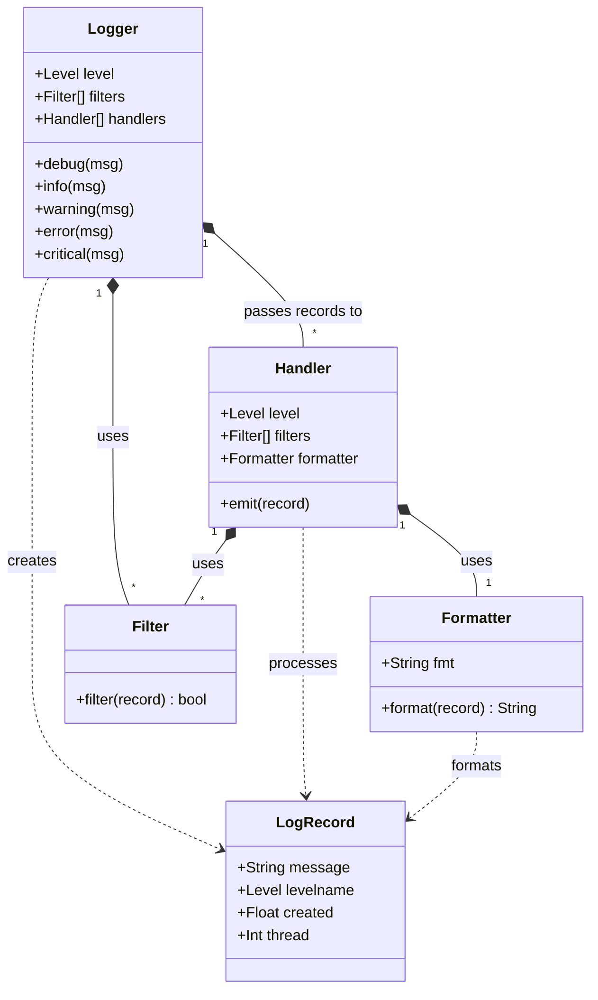

# Cookbook - `logging`

```mermaid
classDiagram
    class Logger {
        +Level level
        +Filter[] filters
        +Handler[] handlers
        +debug(msg)
        +info(msg)
        +warning(msg)
        +error(msg)
        +critical(msg)
    }
    class Handler {
        +Level level
        +Filter[] filters
        +Formatter formatter
        +emit(record)
    }
    class LogRecord {
        +String message
        +Level levelname
        +Float created
        +Int thread
    }
    class Formatter {
        +String fmt
        +format(record) String
    }
    class Filter {
        +filter(record) bool
    }

    Logger "1" *-- "*" Handler : passes records to
    Logger "1" *-- "*" Filter : uses
    Handler "1" *-- "1" Formatter : uses
    Handler "1" *-- "*" Filter : uses
    Logger ..> LogRecord : creates
    Handler ..> LogRecord : processes
    Formatter ..> LogRecord : formats
```
